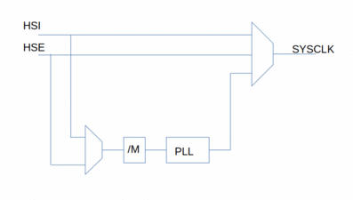
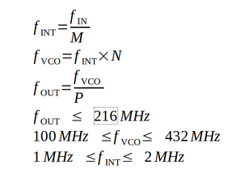

Developing for the STM32F746 using GCC
======================================

Introduction
------------

Using GCC and Makefiles in Linux
Not using HAL

Board description
-----------------

The main features of the STM32F74GDISCOVERY board are:

* STM32F746NGH6 Cortex M7 microprocessor with:
    - 1 MByte of Flash memory
    - 340 KBytes of RAM memory

* Color 4.3" LCD display with 480x272 resolution with capacitive touch screen
* Ethernet with RJ45 connector
* USB Full Speed with OTG
* USG High Speed with OTG
* 128 Mbit Flash memory with Quad SPI interface
* 128 Mbit SDRAM (only 64 MBits accessible)
* Two pushbuttons (one used to reset).
* One green LED controlled by PI1.
* SAI audio codec (?).
* Arduino V3 compatible expansion connectors.

The board has many additional connectors:

* Camera 
* MicroSD card
* SPDIF RCA input connector
* Audio line in
* Audio line out
* Stereo speaker outputs

For programming, it has a inboard ST-LINK interface with a MiniUSB connector.

OBS: There is a, not clearly documented, green LED on ARD_D13 signal (pin 6 of Arduino connector CN7).
It is driven by PI1 (Pin D14 of STM32F746NGH6).

Memory map
----------

The 4 GByte address range of the processor is divides in blocks.

Address Block           |  Size      |  Contents 
------------------------|------------|----------------
0x0000_0000-0x000F_FFFF | 512 MByte  | System Memory, Flash memory, ITCM RAM
0x2000_0000-0x3FFF_FFFF | 512 MByte  | RAM, DTCM Memory registers, etc
0x4000_0000-0x5FFF_FFFF | 512 MByte  | APB1, APB2, AHB1, AHB2, AHB3 peripherals
0x6000_0000-0xDFFF_FFFF |   2 GByte  | Flexible Memory Controller area
0xE000_0000_0xFFFF_FFFF | 512 MByte  | Cortex M7 internal peripherals

###  RAM Memory

There are 340 KBytes of RAM memory, but not contiguous. Some are very fast, other 
can be no volatile.

The RAM is composed of five areas as below:

Area        | Size   | Address range           | Access
------------|--------|------------------------ |-------------------
DTCM        |  64 KB | 0x2000_0000-0x2000_FFFF | All AHB masters, no wait state, 64 bits access
SRAM1       | 240 KB | 0x2001_0000-0x2004_BFFF | All AHB masters
SRAM2       |  16 KB | 0x2004_C000-0x2004_FFFF | All AHB masters
Subtotal    | 320 KB |                         |
ITCM RAM    |  16 KB | 0x0000_0000-0x0000_3FFF | Only CPU, no wait state, 64 bits access, no write 
Backup SRAM |   4 KB | 0x4002_4000-0x4002_4XXX | Powered by VBAK
Total       | 340 KB |                         | 

DTCM, SRAM1 and SRAM2 for a 320 KB contiguous area.
In the board, the VBAT is connected to VDD.

### Flash memory

There is a 1 MByte Flash memory, which can be accessed through two address ranges.

Area          | Size   | Bus  | Address Range           | Observations
--------------|--------|------|-------------------------|------------------------
ITCM Window   | 1 MB   | ITCM | 0x0020_0000-0x002F_FFFF | zero wait state,   ART (Adaptive Real Time ) accelerator,   64 bit access
AXIM window   | 1 MB   | AXIM | 0x0080_0000-0x008F_FFFF | 4 KB cache, 64 bit access

AXIM (Advanced eXtensible Interface) is a ARM technology. It has a 64 bit interface.
ITCM (Tightly-Coupled Memory) is a ST technology.  It has a 64 bit interface split in two 32 bit ports: D0TCM and D1TCM.

In the STM32F74xxx and STM32F75xxx device, the flash memory can be read in chunks of 256 bits. In other devices, 128 bits. The is an ART (Adaptive Real-Time) accelerator), a T technology, that implements, among other things, a Pre-Fetcher (ART Prefetch). The ART in the STM32F7 works only for flash memory access using the ITCM bus and implements a cache of 128/256 bits x 64 lines.It should allow a near 0-wait access to flash.

The latency of Flash memory must be adjuste according the CPU Clock and voltage source as show in the table below.

<table>
<thead>
<td>Wait  states     <td colspan=4>Voltage
<thead>
<td>&nbsp; <td> 2.7 - 3.6 V      <td>  2.4 - 2.7 V    <td> 2.1 - 2.4 V      <td>  1.8 - 2.1 V
<tr>
<td> 0 WS (1 CPU cycle)   <td>    0 < HCLK ≤ 30  <td>    0 < HCLK ≤ 24 <td>    0 < HCLK ≤ 22   <td>   0 < HCLK ≤ 20
<tr>
<td> 1 WS (2 CPU cycles)   <td>  30 < HCLK ≤ 60  <td>  24 < HCLK ≤ 48  <td>  22 < HCLK ≤ 44   <td>  20 < HCLK ≤ 40
<tr>
<td>2 WS (3 CPU cycles)  <td>  60 < HCLK ≤ 90  <td>  48 < HCLK ≤ 72  <td>  44 < HCLK ≤ 66   <td>  40 < HCLK ≤ 60
<tr>
<td>3 WS (4 CPU cycles)  <td>  90 < HCLK ≤ 120 <td>  72 < HCLK ≤ 96  <td>  66 < HCLK ≤ 88   <td>  60 < HCLK ≤ 80
<tr>
<td>4 WS (5 CPU cycles)  <td> 120 < HCLK ≤ 150 <td>  96 < HCLK ≤ 120 <td>  88 < HCLK ≤ 110  <td>  80 < HCLK ≤ 100
<tr>
<td>5 WS (6 CPU cycles)  <td> 150 < HCLK ≤ 180 <td> 120 < HCLK ≤ 144 <td> 110 < HCLK ≤ 132  <td> 100 < HCLK ≤ 120
<tr>
<td>6 WS (7 CPU cycles)  <td> 180 < HCLK ≤ 210 <td> 144 < HCLK ≤ 168 <td> 132 < HCLK ≤ 154  <td> 120 < HCLK ≤ 140
<tr>
<td>7 WS (8 CPU cycles)  <td> 210 < HCLK ≤ 216 <td> 168 < HCLK ≤ 192 <td> 154 < HCLK ≤ 176  <td> 140 < HCLK ≤ 160
<tr>
<td>8 WS (9 CPU cycles)  <td> -                <td> 192 < HCLK ≤ 216 <td> 176 < HCLK ≤ 198  <td> 160 < HCLK ≤ 180
<tr>
<td>9 WS (10 CPU cycles) <td> -                <td> -                <td> 198 < HCLK ≤ 216  <td>  -
</table>

Additionaly,

 * when VOS = 0x01, f_HCLKmax = 144 MHz
 * when VOS = 0x10, f_HCLKmax = 168 MHz or 180 MHz with overdrive
 * when VOS = 0x11, f_HCLKmax = 180 MHz or 216 MHz with overdrive
 * Overdrive only availabe for supply voltages above 2.1 V

After reset, the clock frequency is 16 MHz and the flash is configured to 0 wait states.

There is a system memory in the range 0x0010_0000-0x0010_EDBF, which contains
a serial boot loader written during manufacturing.

THere is an additional 1 KByte OTP memory.

The 4 KB Backup SRAM is controlled by the Flash controller and is located at the range 

### Clock

There are three clock sources for the SYSCLK:

* HSICLK: High Speed Internal Clock is an internal RC oscillator clock with 16 MHz frequency
* HSECLK: High Speed External Clock is an external clock based on a 4-26 MHz crystal or signal
* PLLCLK: Main PLL clock is generated by a PLL unit based on HSI ou HSE and can reach frequency as high as 216 MHz.

There are two additional clock sources, used by certain peripherals:

* LSIRCCLK: Low Speed Internal 32 KHz RC oscillator is used by RTC
* LSECLK: Low Speed External 32768 Hz is based on a external crystal or signal and it is by RTC.
* USBCLK: USB Clock is a 24-60 MHz external crystal based oscillator used by USB HS unit.
* ETHCLK: Ethernet Clock is a 25-50 MHz external crystal based oscillator used by Ethernet MAC unit

The HCLK clock for core, memory, DMA and AHB bus is derived from SYSCLK signal through a prescaler.
This prescaler is a power of 2 in the range 1 to 512. 

The APB bus clock is derived from HCLK through a prescaler, which is a power of 2 
in the range 1 to 16.

Before using a peripheral unit, its clock must be enabled.

There is a PLL unit to generate clock signal for the SAI unit and another one for the I2S units.

Installation
------------

1 - Install the gcc toolchain from (1).

2 - Install the STM32CubeF7 library from (3)

3 - Install stlink-tools (sudo apt install stlink-tools stlink-gui).

4 - Configure Makefile

Now it is possible to compile, flash and debug a project using make.

OBS: stm32flash (sudo apt install stm32flash) flash a STM32 device using serial interface.

Configuration
-------------

### Boot

It is possible to modify the boot address controlling the voltage level on BOOT pin.

BOOT    | Boot address      |  Boot process
--------|-------------------|-------------------------------------------------
0       | BOOT_ADD0[15:0]   |  xxx     Flash on ITCM at 0x0020_0000
1       | BOOT_ADD1[15:0]   |  xxx     System boot loader at 0x0010_0000

System boot loader, programmed during manufacturing, permits the use of a serial interface to
program the Flash memory. This can be disabled by flash level 2 protection.

The BOOT0 pin is set to low thru R45, a 10 K resistor.

### Power Supply

The board can be powered by one of these ways:

* ST-LINK USB connector
* USB HS connector
* USB FS connector
* E5V line (VIN on Arduino CN14 connector or JP2 connector).

The E5V line is powered by a LD1117S50TR regulator with 800 mA current capacity from the VIN pin of the Arduino connector. VIN must be greater than 6 V and less than 12 V. Additionally, the 5 V can be connected to the JP2 connector. In this case, the VIN pin must be left unconnected.

The STM32F746NG MCU is powered by a 3.3 V line, obtained from the 5V USB line thru a LD39050PU33R regulator with 500 mA maximal current. This 5V line is configured by the JP1 connector to use one of the USB connector or the E5V. By default, it is energized by the ST_LINK USB connector. Furthermore, the powering of the STM32F746 is controlled by the ST-LINK MCU thru a ST890CDR switch. It asks the host to deliver 500 mA and only after confirmation, the rest of the board including the STM32F746NG is powered.

    E5V ---------| 1   2 |
    5V-ST_LINK---| 3<->4 |------ 5V
    5V-USB-FS----| 5   6 |
    5V_USB-HS----| 7   8 |

There is LD3985M33R regulator (150 mA maximal current) to power the ST-LINK MCU, a STM32F103CBT6. It is powered automatically by one of the USB connectors or the E5V line. No jumps required.

### Clock Frequency

The board uses four clock signals:

* A 25 MHz oscillator to provide the HSE input of the STM32F746NG
* A 32768 Hz crystal for the LSECLK oscillator inputs of the STM32F746NG
* A 25 MHz oscillator for the USB HS OTG and camera module.
* An 8 MHz crystal for the oscillator inputs of the ST-LINK MCU, a STM32F103CBT6.

Since HSE is generated by an external oscillator, the internal oscillator must be disable by setting HSEBP 
on RCC_CR. To use HSE, its stability must be checked verifying bit HSERDY of RCC_CR.
The HSE in enabled by setting the HSEON bit on RCC_CR.

At reset the internal HSI with a nominal frequency of 16 MHz is used as the source of System Clock (SYSCLK).
It is enabled by setting bin HSION on RCC_CR and its stability in bit RCC_CR.

The main PLL unit is enabled by bit PLLON and its stability by verifying bit PLLRDY. The clock source for the Main PPL unit is set in bit PLLSRC of RCC_PLL.

The output frequency is given by the formulas and must obey the limits shown.

 
The M, N and P factors are shared with the other PLL units. The Q factor is a prescaler for these other clock signals.
The f_USBCLK must be 48 MHz.

The signal used to generate the SYSCLK (System Clock) is specified by field SW of RCC_CFGR.

SW  | SYSCLK
----|-------
00  | HSI
01  | HSE
10  | PLLCLK
11  | not allowed

The AHB prescaler is used to specify the HCLK frequency for core, memory and DMA among others.
It divides the SYSCLK to generate HCLK as shown in table below.

HPRE   |   Divisor
-------|------------
0XXX   |   1
1000   |   2
1001   |   4
1010   |   8
1011   |  16
1100   |  64
1101   | 128
1110   | 256
1111   | 512

OBS: There is no 32 divisor.

The PPRE2 field in RCC_CFGR register is used to configure the prescaler used to generate the APB High Speed Clock. It is a power of 2 in the range 1 to 16. This clock must have a frequency less than 108 MHz.

The PPRE1 field in RCC_CFGR register is used to configure the APB Low Speed Clock. It is a power of 2 in the range 1 to 16. This clock must have a frequency less than 54 MHz.

#### Procedure to change clock source

Enable new clock source
Configure it
Wait until it stabizes
Switch to the new one

#### Procedure to increase clock frequency.

1. Program the new number of wait states to the LATENCY bits in the FLASH_ACR register
2. Check that the new number of wait states is taken into account to access the Flash memory
 by reading the FLASH_ACR register
3. Modify the CPU clock source by writing the SW bits in the RCC_CFGR register
4. If needed, modify the CPU clock prescaler by writing the HPRE bits in RCC_CFGR
5. Check that the new CPU clock source or/and the new CPU clock prescaler value is/are 
 taken into account by reading the clock source status (SWS bits) or/and the AHB prescaler value (HPRE bits), respectively, in the RCC_CFGR register.

### Procedure to decrease clock frequenncy

1. Modify the CPU clock source by writing the SW bits in the RCC_CFGR register
2. If needed, modify the CPU clock prescaler by writing the HPRE bits in RCC_CFGR
3. Check that the new CPU clock source or/and the new CPU clock prescaler value is/are
taken into account by reading the clock source status (SWS bits) or/and the AHB
prescaler value (HPRE bits), respectively, in the RCC_CFGR register
4. Program the new number of wait states to the LATENCY bits in FLASH_ACR
5. Check that the new number of wait states is used to access the Flash memory by
reading the FLASH_ACR register

To unlock write access to FLASH_ACR.

1. Write KEY1 = 0x45670123 in the Flash key register (FLASH_KEYR)
2. Write KEY2 = 0xCDEF89AB in the Flash key register (FLASH_KEYR)

To lock write access to FLASH_ACR, set LOCK bit in the FLASH_ACR register

To access FLASH_ACR register, verify if BSY bit in the FLASH_SR register is unset.

References
----------

1 - [GNU Arm Embedded Toolchain](https://developer.arm.com/tools-and-software/open-source-software/developer-tools/gnu-toolchain/gnu-rm)

2 - [STM32Cube](https://www.st.com/en/ecosystems/stm32cube.html)

3 - [STM32CubeF7](https://www.st.com/en/embedded-software/stm32cubef7.html)

4 - [STM32CubeMX](https://www.st.com/en/development-tools/stm32cubemx.html)

5 - [STM32CubeMX HAL for make and gcc](https://wunderkis.de/stm32cube3/index.html)
